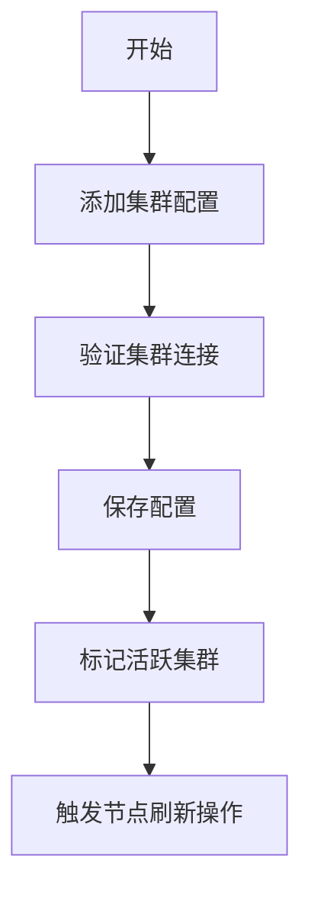

# 集群管理模块详细设计

## 1. 功能流程图


## 2. 核心功能说明
### 2.1 集群配置管理
- 支持多集群注册与维护（增删改查）
- 集群状态标记（当前活跃集群/默认集群）
- 集群连接验证机制
- 新增和修改集群会触发集群节点的更新逻辑，这个我们在 203-节点管理界面.md 里面详细说明

## 3. 数据库设计
### 3.1 集群配置表(t_elastic_cluster)

````sql
CREATE TABLE `t_elastic_cluster` (
  `id` bigint(20) NOT NULL AUTO_INCREMENT COMMENT '主键ID',
  `cluster_code` varchar(255) COLLATE utf8_bin NOT NULL COMMENT '集群代码',
  `cluster_name` varchar(255) COLLATE utf8_bin NOT NULL COMMENT '集群名称',
  `address` text CHARACTER SET utf8mb4 COLLATE utf8mb4_unicode_ci NOT NULL COMMENT '集群地址',
  `current_cluster` tinyint(1) DEFAULT '0' COMMENT '是否为当前使用的集群',
  `default_cluster` tinyint(1) DEFAULT '0' COMMENT '是否为默认集群',
  `cluster_desc` text COLLATE utf8_bin COMMENT '集群描述',
  `create_time` timestamp NOT NULL DEFAULT CURRENT_TIMESTAMP COMMENT '创建时间',
  `update_time` timestamp NOT NULL DEFAULT CURRENT_TIMESTAMP ON UPDATE CURRENT_TIMESTAMP COMMENT '最后修改时间',
  PRIMARY KEY (`id`),
  UNIQUE KEY `cluster_code` (`cluster_code`)
) ENGINE=InnoDB DEFAULT CHARSET=utf8 COLLATE=utf8_bin COMMENT='elastic集群配置表';
````

## 4. 实体类定义

集群管理的使用到的实体类都在目录: dipper-elastic-monitor\elastic-service-provider\src\main\java\com\dipper\monitor\entity\elastic\cluster 

### 4.1 集群实体(ElasticClusterEntity)
```java
public class ElasticClusterEntity {
    private Long id;
    private String clusterCode;
    private String clusterName;
    private String address; // JSON格式节点列表
    private boolean currentCluster;
    private boolean defaultCluster;
    private String clusterDesc;
    private String clusterPolicy;
    private Date monitorStartTime;
    private Date monitorEndTime;
    // getters/setters
}
```

## 5. 关键业务逻辑
### 5.1 集群切换流程
1. 清除当前所有集群的`current_cluster`标记
2. 设置目标集群为`current_cluster=true`
3. 加载该集群下所有节点信息
4. 初始化集群监控任务


## 6. API接口设计
controller都在 dipper-elastic-monitor\elastic-service-provider\src\main\java\com\dipper\monitor\controller\elsatic\manager_cluster\ElasticClusterManagerController.java
