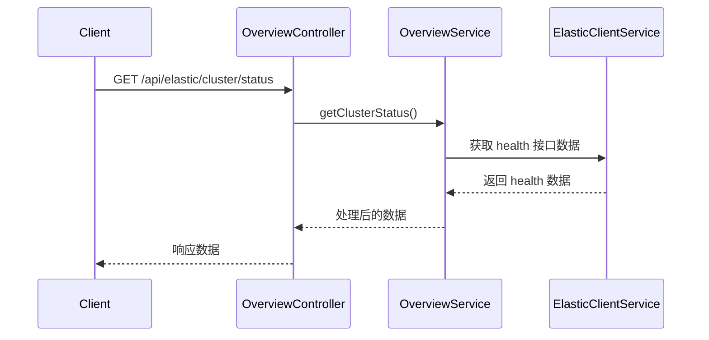
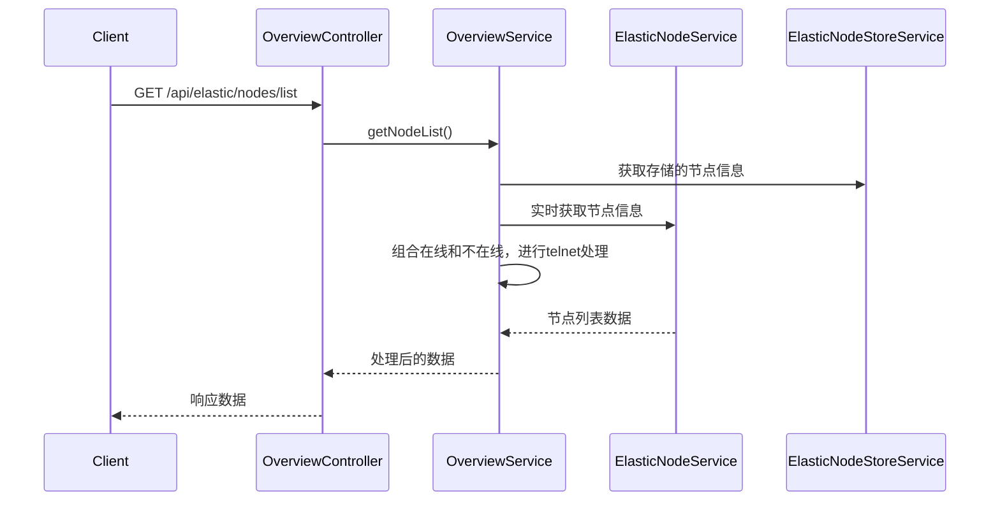
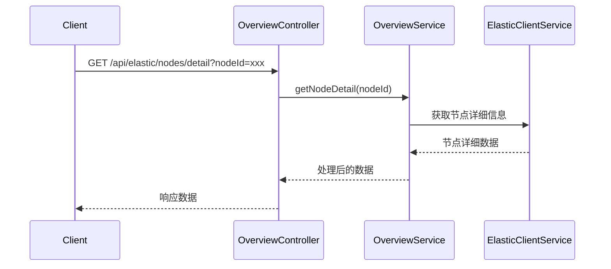
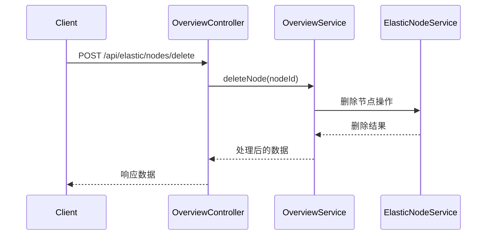
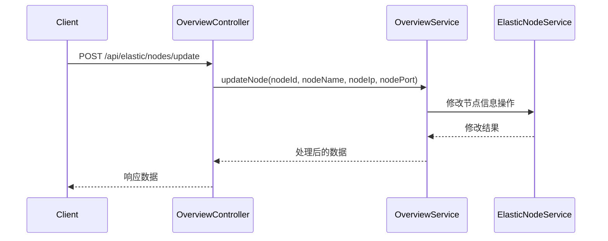
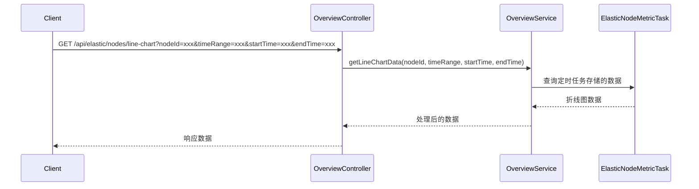

# 集群预览界面详细设计

规则：前端设计主要是为了方便理解我要展示什么数据，这里我们是后端开发，只需要展示相关的接口即可。

# 1. 界面设计

```plaintext
|-----------------------------------------------------------------------------
| 集群状态   green  集群名称: mycluster  提示信息：集群分片不正常
----------------------------------------------------------------
| 表格显示es状态信息 cat/health接口返回结果    右边有个刷新按钮 --------------------
--------------------------------------------------------------------------
| 节点管理界面 	(表格展示)														|
| 表格显示:  序号 节点名称  节点ip 节点port  在线状态 连通状态  jvm 信息 磁盘占用     线程数   木桶效应   操作 |
| 案例:      1    1.es1   1.1.1.1 9200  green  green    jvm信息   56G/100G  3445    详细  删除 修改  折线图 
```

## 1.1 界面交互细节
- **刷新按钮**：点击后，重新调用后端接口获取最新的集群状态信息和节点信息。
- **详细按钮**：点击后弹出窗口，展示节点的详细信息。
- **删除按钮**：点击后弹出确认对话框，确认删除该节点。
- **修改按钮**：点击后弹出表单，可对节点信息进行修改。
- **折线图按钮**：点击后弹出窗口，展示节点的性能指标折线图。

# 2. 类结构设计

```plaintext
# 接口类，提供界面所需一切接口
com.dipper.monitor.controller.elastic.overview.OverviewController
```

方法实现类

```plaintext
com.dipper.monitor.service.elastic.overview.OverviewService
com.dipper.monitor.service.elastic.overview.impl.OverviewServiceImpl
```

客户端交互类

```plaintext
com.dipper.monitor.service.elastic.client.ElasticClientService
```

# 3. 集群状态

集群状态信息，主要是根据 health 接口实时获取， 集群名称也是。

## 3.1 接口详细设计

### 3.1.1 获取集群状态信息接口
- **接口名称**：`getClusterStatus`
- **接口路径**：`/api/elastic/cluster/status`
- **请求方法**：`GET`
- **请求参数**：无
- **响应参数**：
  | 参数名       | 类型   | 描述               |
  |--------------|--------|--------------------|
  | clusterStatus| String | 集群状态（green、yellow、red） |
  | clusterName  | String | 集群名称           |
  | healthInfo   | String | cat/health 接口返回结果 |
  | tipMessage   | String | 提示信息           |

### 3.1.2 示例响应
```json
{
  "code": 200,
  "message": "success",
  "data": {
    "clusterStatus": "green",
    "clusterName": "mycluster",
    "healthInfo": "{...}",
    "tipMessage": "集群分片不正常"
  }
}
```

提示信息这里是另外一个接口，获取集群的分片是否正常，生命周期是否正常 （todo: 可以暂不考虑）

时序图




# 4. 节点信息来源

在我们创建或者更改集群信息的时候，会调用接口：`com.dipper.monitor.service.elastic.nodes.ElasticNodeService#refreshNodes` 获取集群节点信息，然后只增加节点信息。因为我想做，如果一个节点掉线了，可以监控到，因为实时获取的都是在线节点。

## 4.1 接口详细设计

### 4.1.1 获取节点列表接口
- **接口名称**：`getNodeList`
- **接口路径**：`/api/elastic/nodes/list`
- **请求方法**：`GET`
- **请求参数**：无
- **响应参数**：
  | 参数名       | 类型   | 描述               |
  |--------------|--------|--------------------|
  | nodeList     | Array  | 节点列表           |
  | nodeList.id  | Integer| 序号               |
  | nodeList.name| String | 节点名称           |
  | nodeList.ip  | String | 节点 IP            |
  | nodeList.port| Integer| 节点端口           |
  | nodeList.onlineStatus | String | 在线状态（green、red） |
  | nodeList.connectStatus | String | 连通状态（green、red） |
  | nodeList.jvmInfo | String | JVM 信息           |
  | nodeList.diskUsage | String | 磁盘占用情况       |
  | nodeList.threadCount | Integer | 线程数            |
  | nodeList.barrelEffect | String | 木桶效应情况       |

### 4.1.2 示例响应
```json
{
  "code": 200,
  "message": "success",
  "data": {
    "nodeList": [
      {
        "id": 1,
        "name": "1.es1",
        "ip": "1.1.1.1",
        "port": 9200,
        "onlineStatus": "green",
        "connectStatus": "green",
        "jvmInfo": "jvm信息",
        "diskUsage": "56G/100G",
        "threadCount": 3445,
        "barrelEffect": "正常"
      }
    ]
  }
}
```

时序图




# 5. 详情

点击详情会弹窗，弹窗展示信息如下

```plaintext
第一部分： 节点的基本信息
第二部分： jvm 信息 磁盘占用  木桶效应 等信息
第三部分：线程信息等
第四部分：右下角有个原始信息按钮，原始信息是一个按钮，点击的时候，会再次弹窗，显示改节点的原始大json信息，一个新的弹窗
```

## 5.1 接口详细设计

### 5.1.1 获取节点详情接口
- **接口名称**：`getNodeDetail`
- **接口路径**：`/api/elastic/nodes/detail`
- **请求方法**：`GET`
- **请求参数**：
  | 参数名       | 类型   | 描述               |
  |--------------|--------|--------------------|
  | nodeId       | Integer| 节点 ID            |
- **响应参数**：
  | 参数名       | 类型   | 描述               |
  |--------------|--------|--------------------|
  | basicInfo    | Object | 节点基本信息       |
  | jvmInfo      | String | JVM 信息           |
  | diskUsage    | String | 磁盘占用情况       |
  | barrelEffect | String | 木桶效应情况       |
  | threadInfo   | String | 线程信息           |
  | rawInfo      | String | 原始 JSON 信息     |

### 5.1.2 示例响应
```json
{
  "code": 200,
  "message": "success",
  "data": {
    "basicInfo": {
      "name": "1.es1",
      "ip": "1.1.1.1",
      "port": 9200
    },
    "jvmInfo": "jvm信息",
    "diskUsage": "56G/100G",
    "barrelEffect": "正常",
    "threadInfo": "线程信息",
    "rawInfo": "{...}"
  }
}
```

时序图




# 6. 删除和修改

## 6.1 删除节点

### 6.1.1 接口详细设计
- **接口名称**：`deleteNode`
- **接口路径**：`/api/elastic/nodes/delete`
- **请求方法**：`POST`
- **请求参数**：
  | 参数名       | 类型   | 描述               |
  |--------------|--------|--------------------|
  | nodeId       | Integer| 节点 ID            |
- **响应参数**：
  | 参数名       | 类型   | 描述               |
  |--------------|--------|--------------------|
  | code         | Integer| 响应码             |
  | message      | String | 响应信息           |

### 6.1.2 示例响应
```json
{
  "code": 200,
  "message": "删除成功"
}
```

时序图




## 6.2 修改节点信息

### 6.2.1 接口详细设计
- **接口名称**：`updateNode`
- **接口路径**：`/api/elastic/nodes/update`
- **请求方法**：`POST`
- **请求参数**：
  | 参数名       | 类型   | 描述               |
  |--------------|--------|--------------------|
  | nodeId       | Integer| 节点 ID            |
  | nodeName     | String | 节点名称           |
  | nodeIp       | String | 节点 IP            |
  | nodePort     | Integer| 节点端口           |
- **响应参数**：
  | 参数名       | 类型   | 描述               |
  |--------------|--------|--------------------|
  | code         | Integer| 响应码             |
  | message      | String | 响应信息           |

### 6.2.2 示例响应
```json
{
  "code": 200,
  "message": "修改成功"
}
```

时序图




# 7. 折线图

点击折线图，是一个弹窗

```plaintext
第一部分：时间范围选择器  选择查看的时间范围
第2部分：GC折线图
第3部分：网络使用折线图
第4部分：内存使用折线图
```

折线图

1. 需要支持选择时间范围，最近 1 小时 3 小时 6 小时 1 天 3 天 6 天 自定义
2. 折线图支持，框选一段时间范围，查看细节

## 7.1 定时任务

这里涉及一个定时任务，`com.dipper.monitor.task.nodes.ElasticNodeMetricTask#elasticNodesUpdateTask`

1. 获取所有节点信息，从数据库获取
2. 获取正在运行节点的信息，获取 GC  网络 内存
3. 然后存储起来

对于的数据块存储格式如下

```sql
CREATE TABLE `t_elastic_metric_node` (
  `id` bigint(20) NOT NULL AUTO_INCREMENT,
  `batch_id` bigint(20) NOT NULL, 
  `cluster_code` varchar(255) COLLATE utf8mb4_bin NOT NULL,
  `module_name` varchar(255) COLLATE utf8mb4_bin NOT NULL,
  `entity_name` varchar(255) COLLATE utf8mb4_bin NOT NULL,
  `section_name` varchar(256) COLLATE utf8mb4_bin NOT NULL COMMENT '三级区分',
  `metric_key` varchar(255) COLLATE utf8mb4_bin NOT NULL,
  `metric_value` double DEFAULT NULL,
  `create_time` timestamp NULL DEFAULT CURRENT_TIMESTAMP,
  `update_time` timestamp NULL DEFAULT CURRENT_TIMESTAMP ON UPDATE CURRENT_TIMESTAMP,
  PRIMARY KEY (`id`)
) ENGINE=InnoDB DEFAULT CHARSET=utf8mb4 COLLATE=utf8mb4_bin;
```

- `cluster_code` 是集群唯一识别码
- `module_name` 模块名称，这是一个枚举
- `entity_name` 是节点名称， ip 或者域名 + 端口 唯一确定一个实体类
- `section_name` 是当出现需要三级分级的时候使用，一般不使用
- `metric_key` 比如 GC 网络 内存 ，也是枚举使用 英文
- `metric_value` 某一时刻的指标值

## 7.2 接口详细设计

### 7.2.1 获取折线图数据接口
- **接口名称**：`getLineChartData`
- **接口路径**：`/api/elastic/nodes/line-chart`
- **请求方法**：`GET`
- **请求参数**：
  | 参数名       | 类型   | 描述               |
  |--------------|--------|--------------------|
  | nodeId       | Integer| 节点 ID            |
  | timeRange    | String | 时间范围（如：1h、3h、6h、1d、3d、6d、custom） |
  | startTime    | String | 自定义开始时间（timeRange 为 custom 时必填） |
  | endTime      | String | 自定义结束时间（timeRange 为 custom 时必填） |
- **响应参数**：
  | 参数名       | 类型   | 描述               |
  |--------------|--------|--------------------|
  | gcData       | Array  | GC 折线图数据       |
  | networkData  | Array  | 网络使用折线图数据 |
  | memoryData   | Array  | 内存使用折线图数据 |

### 7.2.2 示例响应
```json
{
  "code": 200,
  "message": "success",
  "data": {
    "gcData": [
      {
        "time": "2025-04-16 12:00:00",
        "value": 10.5
      }
    ],
    "networkData": [
      {
        "time": "2025-04-16 12:00:00",
        "value": 20.3
      }
    ],
    "memoryData": [
      {
        "time": "2025-04-16 12:00:00",
        "value": 30.7
      }
    ]
  }
}
```

时序图



