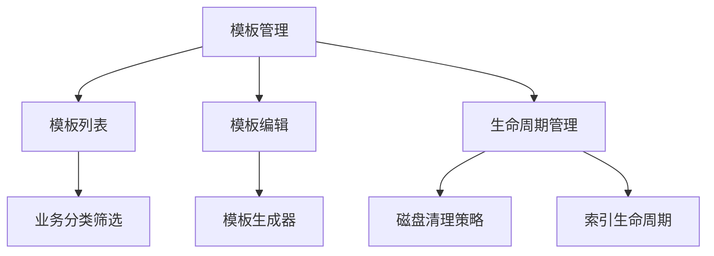
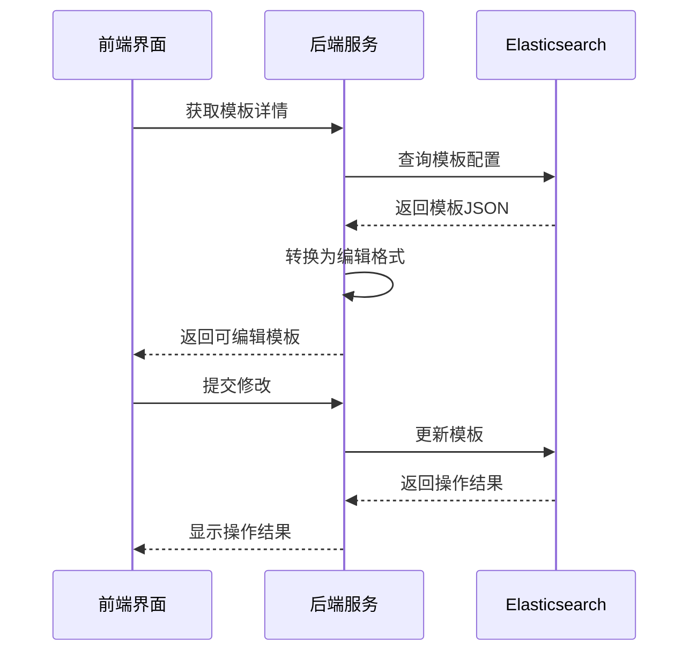
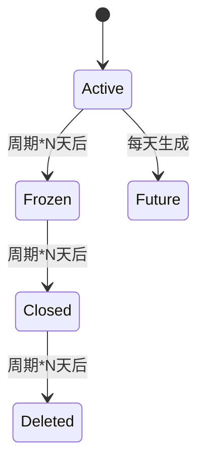

# 模板管理界面详细设计

# 1.界面设置如下

```
--------------------------------------------- 数据清理配置 生命周期配置
------------------------------------------------------------------
ID  模版code 模版业务名称  index_patterns 别名样式 操作
1  baas-flow 流量日志 baas-flow-yyyyMMdd-* securitylog-flow-yyyyMMdd  详情 编辑   滚动索引  历史模版
```

## 2. 功能架构图


## 2. 核心功能设计
### 2.1 模板列表设计
#### 2.1.1 列表数据结构
```javascript
// 模板列表数据结构
const templateList = {
  columns: [
    { title: 'ID', key: 'id' },
    { title: '模板code', key: 'code' },
    { title: '业务名称', key: 'businessName' },
    { title: '索引模式', key: 'indexPattern' },
    { title: '别名样式', key: 'aliasPattern' },
    { title: '操作', key: 'actions' }
  ],
  data: [
    {
      id: 1,
      code: 'ailpha-baas-flow',
      businessName: '流量日志',
      indexPattern: 'ailpha-baas-flow-yyyyMMdd-*',
      aliasPattern: 'ailpha-securitylog-flow-yyyyMMdd',
      actions: ['详情', '生命周期', '滚动索引']
    }
  ]
}
```

### 2.2 模板编辑流程


### 2.3 生命周期策略
#### 2.3.1 磁盘清理策略表
```yaml
# 磁盘清理策略配置
policies:
  - template: ailpha-baas-flow
    cycle: daily
    threshold: 80%
    priority: 1
    retention: 2d
  - template: ailpha-baas-alarm
    cycle: daily
    threshold: 80%
    priority: 2
    retention: 1d
```

#### 2.3.2 索引生命周期状态机


## 3. 数据库设计
### 3.1 模板配置表(es_template_config)
| 字段名 | 类型 | 描述 |
|-------|------|------|
| id | bigint | 主键ID |
| template_code | varchar(64) | 模板代码 |
| business_name | varchar(128) | 业务名称 |
| index_pattern | varchar(255) | 索引模式 |
| alias_pattern | varchar(255) | 别名模式 |
| template_config | text | 模板配置(JSON) |
| lifecycle_config | text | 生命周期配置(JSON) |

### 3.2 模板状态表(es_template_stats)
| 字段名 | 类型 | 描述 |
|-------|------|------|
| id | bigint | 主键ID |
| template_code | varchar(64) | 模板代码 |
| index_count | int | 索引总数 |
| closed_count | int | 关闭索引数 |
| frozen_count | int | 冻结索引数 |
| shard_count | int | 分片总数 |
| segment_count | int | 段总数 |
| update_time | datetime | 更新时间 |

## 4. API接口设计
### 4.1 获取模板详情
```json
GET /api/templates/{templateCode}
Response:
{
  "code": "ailpha-baas-flow",
  "stats": {
    "indexCount": 35,
    "closedCount": 4,
    "shardCount": 268
  },
  "config": {
    "settings": {...},
    "mappings": {...}
  }
}
```

### 4.2 更新模板配置
```json
PUT /api/templates/{templateCode}
Body:
{
  "settings": {
    "number_of_shards": 3
  },
  "aliases": {
    "{alias_pattern}": {}
  }
}
```

### 4.3 执行滚动索引
```json
POST /api/templates/{templateCode}/rollover
Body:
{
  "conditions": {
    "max_age": "7d",
    "max_docs": 1000000
  }
}
```

## 5. 前端组件设计
### 5.1 TemplateEditor.vue
```vue
<template>
  <div>
    <Tabs>
      <TabPane label="基本信息">
        <TemplateBasicInfo :data="basicInfo"/>
      </TabPane>
      <TabPane label="配置编辑">
        <JsonEditor v-model="templateConfig"/>
      </TabPane>
      <TabPane label="生命周期">
        <LifecycleConfig :policy="lifecyclePolicy"/>
      </TabPane>
    </Tabs>
    <Button @click="saveTemplate">保存</Button>
    <Button @click="rollover">滚动索引</Button>
  </div>
</template>
```

## 6. 定时任务设计
```yaml
# 定时任务配置
schedules:
  - name: generate_future_index
    cron: "0 0 3 * * ?"  # 每天凌晨3点
    task: "template.generateFutureIndex"
  - name: clean_expired_index
    cron: "0 0 2 * * ?"  # 每天凌晨2点
    task: "template.cleanByPolicy"
```
```

这个文档完整覆盖了模板管理界面的各项设计要素，包括模板编辑、生命周期管理和定时任务等核心功能。需要我继续为其他模块（如索引管理或段管理）创建类似的详细设计文档吗？