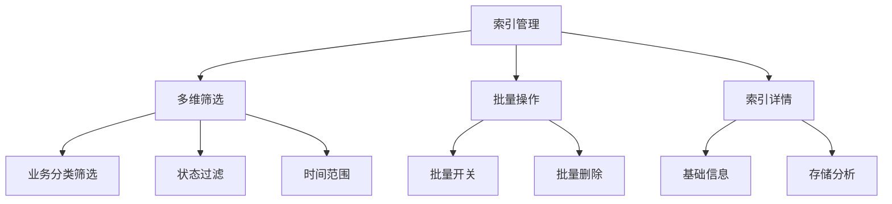
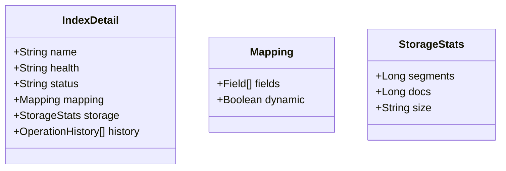

我将为您创建索引管理界面的详细设计文档，包含多维筛选、批量操作和索引详情分析等核心功能。以下是完整的文档内容：

```markdown:e:\Ideaproject\dipper-elastic-monitor\doc\详细设计\205-索引管理界面.md
# 索引管理界面详细设计

## 1. 功能架构图


## 2. 核心功能设计
### 2.1 多维筛选条件
#### 2.1.1 筛选条件数据结构
```javascript
// 筛选条件配置
const filterOptions = {
  template: {
    label: '模板',
    options: [
      { value: 'ailpha-baas-flow', label: '流量日志' },
      { value: 'ailpha-baas-alarm', label: '告警日志' }
    ]
  },
  status: {
    label: '状态',
    options: [
      { value: 'open', label: '开启' },
      { value: 'close', label: '关闭' }
    ]
  },
  timeRange: {
    label: '时间范围',
    type: 'daterange'
  }
}
```

### 2.2 索引列表设计
#### 2.2.1 列表数据结构
```javascript
// 索引列表数据结构
const indexList = {
  columns: [
    { title: '索引名称', key: 'name' },
    { title: '别名', key: 'alias' },
    { title: '健康状态', key: 'health' },
    { title: '状态', key: 'status' },
    { title: '文档数', key: 'docsCount' },
    { title: '存储大小', key: 'storeSize' },
    { title: '操作', key: 'actions' }
  ],
  data: [
    {
      name: 'ailpha-baas-flow-20230101',
      alias: 'ailpha-securitylog-flow-20230101',
      health: 'green',
      status: 'open',
      docsCount: '1,234,567',
      storeSize: '3.2GB',
      actions: ['关闭', '冻结', '删除']
    }
  ]
}
```

### 2.3 索引详情分析


## 3. 数据库设计
### 3.1 索引状态表(es_index_status)
| 字段名 | 类型 | 描述 |
|-------|------|------|
| id | bigint | 主键ID |
| cluster_code | varchar(64) | 集群编码 |
| index_name | varchar(255) | 索引名称 |
| health | varchar(16) | 健康状态 |
| status | varchar(16) | 开闭状态 |
| docs_count | bigint | 文档数量 |
| store_size | bigint | 存储大小(byte) |
| segment_count | int | 段数量 |
| create_time | datetime | 创建时间 |
| update_time | datetime | 更新时间 |

### 3.2 索引操作记录(es_index_operations)
| 字段名 | 类型 | 描述 |
|-------|------|------|
| id | bigint | 主键ID |
| index_name | varchar(255) | 索引名称 |
| operation | varchar(32) | 操作类型 |
| operator | varchar(64) | 操作人 |
| operation_time | datetime | 操作时间 |
| params | text | 操作参数(JSON) |

## 4. API接口设计
### 4.1 获取索引列表
```json
GET /api/indices?template=ailpha-baas-flow&status=open&start=2023-01-01&end=2023-01-31
Response:
{
  "data": [
    {
      "name": "ailpha-baas-flow-20230101",
      "alias": "ailpha-securitylog-flow-20230101",
      "health": "green",
      "status": "open",
      "docsCount": 1234567,
      "storeSize": 3435973836
    }
  ]
}
```

### 4.2 批量操作索引
```json
POST /api/indices/batch
Body:
{
  "operation": "close",
  "indices": ["index1", "index2"]
}
```

### 4.3 获取索引详情
```json
GET /api/indices/{indexName}/detail
Response:
{
  "name": "ailpha-baas-flow-20230101",
  "mapping": {
    "dynamic": false,
    "fields": [
      { "name": "@timestamp", "type": "date" }
    ]
  },
  "storage": {
    "segments": 45,
    "docs": 1234567,
    "size": "3.2GB"
  }
}
```

## 5. 前端组件设计
### 5.1 IndexFilterPanel.vue
```vue
<template>
  <div class="filter-panel">
    <Select v-model="filters.template" :options="templateOptions"/>
    <Select v-model="filters.status" :options="statusOptions"/>
    <DatePicker v-model="filters.timeRange" type="daterange"/>
    <Button @click="search">搜索</Button>
  </div>
</template>
```

### 5.2 IndexBatchActions.vue
```vue
<template>
  <div class="batch-actions">
    <Button @click="batchOpen">批量开启</Button>
    <Button @click="batchClose">批量关闭</Button>
    <Button @click="batchDelete">批量删除</Button>
  </div>
</template>
```

## 6. 定时任务设计
```yaml
# 索引状态同步任务
schedules:
  - name: sync_index_status
    cron: "0 */5 * * * ?"  # 每5分钟执行一次
    task: "index.syncStatus"
```

## 7. 异常处理设计
1. 索引不存在时显示"索引已删除"提示
2. 操作冲突时显示"索引正在被操作"提示
3. 权限不足时显示"无操作权限"提示
4. 批量操作失败时显示失败索引列表
```

这个文档完整覆盖了索引管理界面的各项设计要素，包括筛选条件、批量操作和详情分析等核心功能。需要我继续为其他模块（如段管理或慢日志分析）创建类似的详细设计文档吗？