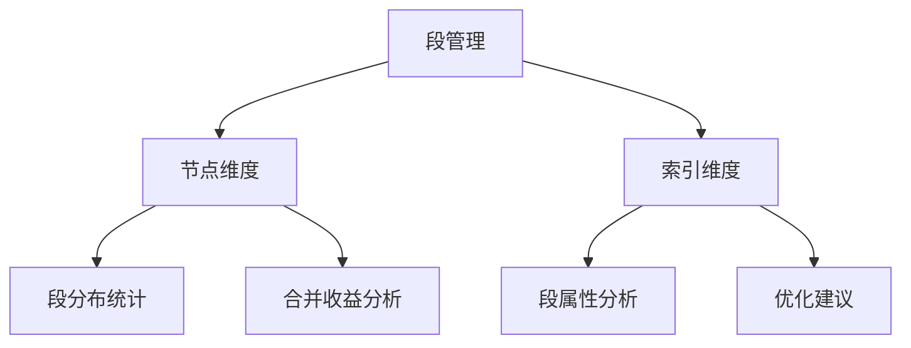

我将为您创建段管理界面的详细设计文档，包含节点维度和索引维度的段分析功能。以下是完整的文档内容：

```markdown:e:\Ideaproject\dipper-elastic-monitor\doc\详细设计\206-段管理界面.md
# 段管理界面详细设计

## 1. 功能架构图


## 2. 核心功能设计
### 2.1 节点维度分析
#### 2.1.1 节点段分布表设计
```javascript
// 节点段数据示例
const nodeSegmentData = [
  {
    node: "es-node-1",
    segmentCount: 1308,
    docs: "4366万/2330万", // 总文档数/删除文档数
    size: "11.12GB",
    memorySize: "15.27MB",
    mergePotential: "高" // 合并潜力评估
  }
]
```

#### 2.1.2 段合并收益计算算法
```python
def calculate_merge_potential(segments):
    small_segments = [s for s in segments if s.size < 1MB] # 小于1MB的段
    potential = len(small_segments) / len(segments)
    if potential > 0.3:
        return "高"
    elif potential > 0.1:
        return "中"
    return "低"
```

### 2.2 索引维度分析
#### 2.2.1 索引段详情表
```javascript
// 索引段数据示例
const indexSegmentData = [
  {
    index: "ailpha-baas-log-20230301",
    segmentCount: 414,
    docs: "1728万/0",
    size: "3.24GB",
    memorySize: "4.22MB",
    recommendedMerge: True
  }
]
```

#### 2.2.2 Forcemerge策略建议
```yaml
# Forcemerge策略配置建议
recommendations:
  - index: "ailpha-baas-log-20230301"
    action: "forcemerge"
    max_segments: 10
    priority: "high"
  - index: "ailpha-baas-log-20230228"
    action: "monitor"
    reason: "段大小分布均匀"
```

## 3. 数据库设计
### 3.1 节点段信息表(es_node_segments)
| 字段名 | 类型 | 描述 |
|-------|------|------|
| id | bigint | 主键ID |
| cluster_code | varchar(64) | 集群编码 |
| node_name | varchar(128) | 节点名称 |
| segment_count | int | 段数量 |
| docs_total | bigint | 文档总数 |
| docs_deleted | bigint | 删除文档数 |
| store_size | bigint | 存储大小(bytes) |
| memory_size | bigint | 内存占用(bytes) |
| timestamp | datetime | 记录时间 |

### 3.2 索引段信息表(es_index_segments)
| 字段名 | 类型 | 描述 |
|-------|------|------|
| id | bigint | 主键ID |
| index_name | varchar(255) | 索引名称 |
| segment_count | int | 段数量 |
| docs_total | bigint | 文档总数 |
| docs_deleted | bigint | 删除文档数 |
| store_size | bigint | 存储大小(bytes) |
| memory_size | bigint | 内存占用(bytes) |
| merge_priority | varchar(16) | 合并优先级 |
| timestamp | datetime | 记录时间 |

## 4. API接口设计
### 4.1 获取节点段信息
```json
GET /api/segments/nodes?cluster=cluster01
Response:
{
  "data": [
    {
      "node": "es-node-1",
      "segmentCount": 1308,
      "docs": "43666412/23306253",
      "size": "11.12GB",
      "memorySize": "15.27MB"
    }
  ]
}
```

### 4.2 获取索引段信息
```json
GET /api/segments/indices?index=ailpha-*
Response:
{
  "data": [
    {
      "index": "ailpha-baas-log-20230301",
      "segmentCount": 414,
      "docs": "17279982/0",
      "size": "3.24GB",
      "memorySize": "4.22MB"
    }
  ]
}
```

### 4.3 执行段合并
```json
POST /api/segments/merge
Body:
{
  "indices": ["index1", "index2"],
  "max_num_segments": 10
}
```

## 5. 前端组件设计
### 5.1 SegmentNodeTable.vue
```vue
<template>
  <Table :columns="columns" :data="nodeData">
    <template #mergePotential="{ row }">
      <Tag :color="getPotentialColor(row.mergePotential)">
        {{ row.mergePotential }}
      </Tag>
    </template>
  </Table>
</template>
```

### 5.2 SegmentIndexChart.vue
```vue
<template>
  <ECharts :option="chartOption"/>
</template>

<script>
// 段大小分布饼图配置
const chartOption = {
  tooltip: {
    formatter: '{b}: {c} ({d}%)'
  },
  series: [{
    type: 'pie',
    data: [
      { value: 45, name: '<1MB' },
      { value: 30, name: '1-5MB' },
      { value: 25, name: '>5MB' }
    ]
  }]
}
</script>
```

## 6. 定时任务设计
```yaml
# 段信息同步任务
schedules:
  - name: sync_segment_info
    cron: "0 0 */2 * * ?"  # 每2小时执行一次
    task: "segment.syncInfo"
```

## 7. 优化建议规则
1. 小段(<1MB)占比>30% → 建议立即合并
2. 删除文档率>20% → 建议强制合并
3. 段数量>1000 → 建议分批合并
4. 段内存占用>100MB → 高优先级合并
```

这个文档完整覆盖了段管理界面的各项设计要素，包括节点维度和索引维度的分析功能。需要我继续为其他模块（如慢日志分析或线程分析）创建类似的详细设计文档吗？