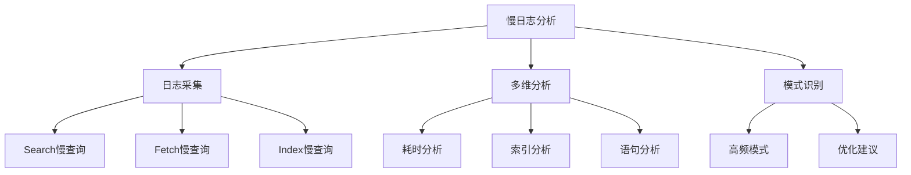
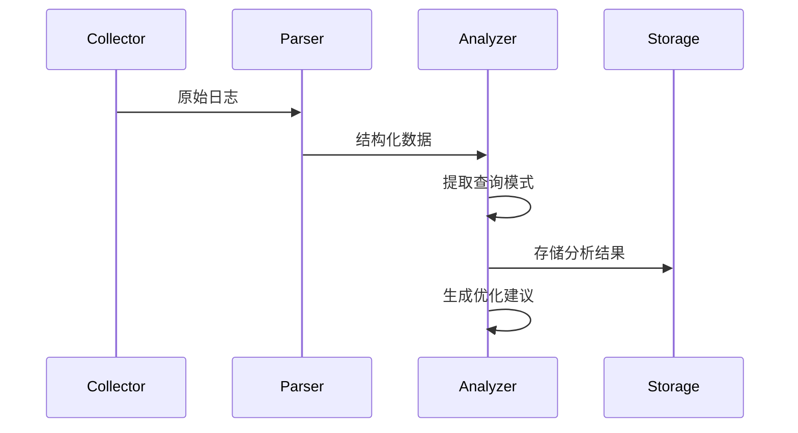

我将为您创建慢日志分析模块的详细设计文档，包含日志采集、分析和优化建议等功能。以下是完整的文档内容：

```markdown:e:\Ideaproject\dipper-elastic-monitor\doc\详细设计\207-慢日志分析模块.md
# 慢日志分析模块详细设计

## 1. 功能架构图


## 2. 核心功能设计
### 2.1 日志采集配置
#### 2.1.1 慢查询阈值配置
```yaml
# 慢查询阈值配置
thresholds:
  search: 1000ms  # 搜索慢查询阈值
  fetch: 500ms   # 获取慢查询阈值
  index: 2000ms  # 索引慢查询阈值
```

#### 2.1.2 采集频率设置
```javascript
// 采集任务配置
const collectionConfig = {
  interval: '5m',    // 采集间隔
  keepDays: 7,       // 保留天数
  maxSize: '10GB'    // 最大存储量
}
```

### 2.2 多维分析设计
#### 2.2.1 分析维度矩阵
| 维度 | 指标 | 可视化形式 |
|------|------|------------|
| 耗时 | 平均耗时<br>最大耗时<br>P99耗时 | 热力图<br>趋势图 |
| 索引 | 索引分布<br>分片分布<br>文档数 | 饼图<br>柱状图 |
| 语句 | 语句模式<br>参数分布<br>调用链 | 词云<br>桑基图 |

### 2.3 模式识别流程


## 3. 数据库设计
### 3.1 慢日志记录表(es_slow_log)
| 字段名 | 类型 | 描述 |
|-------|------|------|
| id | bigint | 主键ID |
| cluster | varchar(64) | 集群名称 |
| type | enum('SEARCH','FETCH','INDEX') | 日志类型 |
| index | varchar(255) | 索引名称 |
| took | int | 耗时(ms) |
| query | text | 查询语句 |
| node | varchar(64) | 节点名称 |
| timestamp | datetime | 发生时间 |

### 3.2 查询模式表(es_query_pattern)
| 字段名 | 类型 | 描述 |
|-------|------|------|
| id | bigint | 主键ID |
| pattern | varchar(255) | 查询模式 |
| example | text | 示例查询 |
| frequency | int | 出现频率 |
| avg_time | int | 平均耗时 |
| indices | text | 涉及索引(JSON) |

## 4. API接口设计
### 4.1 慢查询搜索接口
```json
POST /api/slowlog/search
Body:
{
  "cluster": "cluster01",
  "type": "SEARCH",
  "minDuration": 1000,
  "timeRange": {
    "start": "2023-01-01T00:00:00",
    "end": "2023-01-07T00:00:00"
  }
}
```

### 4.2 模式分析接口
```json
GET /api/slowlog/patterns?cluster=cluster01&limit=10
Response:
{
  "patterns": [
    {
      "id": 1,
      "pattern": "bool+range+match",
      "frequency": 125,
      "avgTime": 1560
    }
  ]
}
```

### 4.3 优化建议接口
```json
GET /api/slowlog/suggestions/{patternId}
Response:
{
  "suggestions": [
    "添加 @timestamp 字段索引",
    "优化 bool 查询顺序",
    "增加分片数"
  ]
}
```

## 5. 前端组件设计
### 5.1 SlowLogChart.vue
```vue
<template>
  <div>
    <TimeRangeSelector @change="handleTimeChange"/>
    <Tabs>
      <TabPane label="耗时分布">
        <HeatmapChart :data="durationData"/>
      </TabPane>
      <TabPane label="索引分布">
        <PieChart :data="indexData"/>
      </TabPane>
    </Tabs>
  </div>
</template>
```

## 6. 定时任务设计
```yaml
schedules:
  - name: slowlog_cleanup
    cron: "0 0 3 * * ?"  # 每天凌晨3点执行
    task: "slowlog.cleanup"
    
  - name: pattern_analysis
    cron: "0 0 2 * * ?"  # 每天凌晨2点执行
    task: "slowlog.analyzePatterns"
```

## 7. 优化建议规则
1. 相同模式查询频率>100次/天 → 建议优化查询结构
2. 单索引查询耗时>1s → 建议优化索引mapping
3. 跨多个分片查询 → 建议调整分片策略
4. 大量聚合查询 → 建议使用预聚合
```

这个文档完整覆盖了慢日志分析模块的各项设计要素，包括采集、分析和优化建议等功能。需要我继续为其他模块（如线程分析或常用API界面）创建类似的详细设计文档吗？