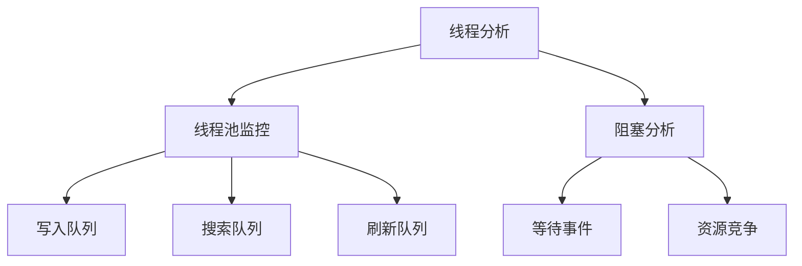
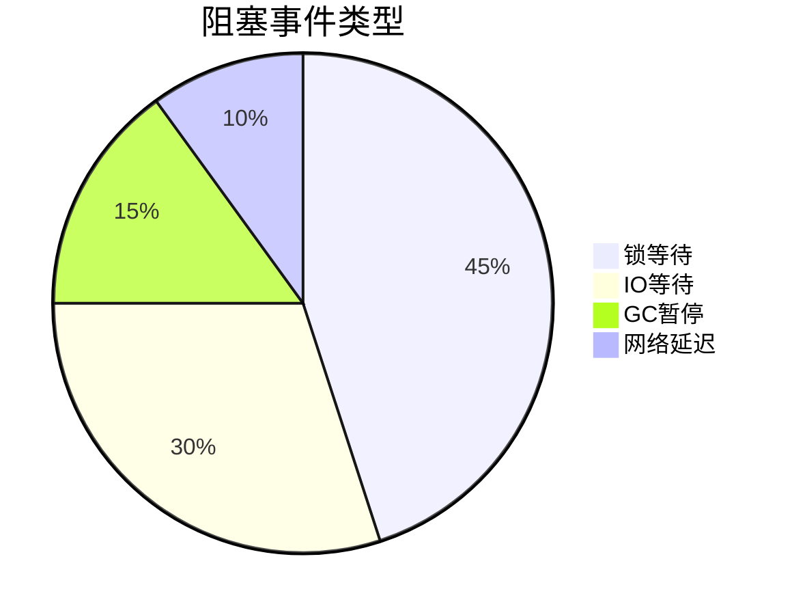

我将为您创建ES线程分析模块的详细设计文档，包含线程池监控和阻塞分析等核心功能。以下是完整的文档内容：

```markdown:e:\Ideaproject\dipper-elastic-monitor\doc\详细设计\208-ES线程分析模块.md
# ES线程分析模块详细设计

## 1. 功能架构图


## 2. 核心功能设计
### 2.1 线程池监控
#### 2.1.1 线程池状态表
```javascript
// 线程池数据结构
const threadPools = {
  columns: [
    { title: '线程池', key: 'name' },
    { title: '活跃线程', key: 'active' },
    { title: '队列深度', key: 'queue' },
    { title: '拒绝次数', key: 'rejected' },
    { title: '状态', key: 'status' }
  ],
  data: [
    {
      name: 'bulk',
      active: 12,
      queue: 45,
      rejected: 3,
      status: 'warning'
    }
  ]
}
```

#### 2.1.2 队列深度告警规则
```yaml
# 告警阈值配置
alerts:
  - pool: bulk
    queue_warning: 50
    queue_critical: 100
  - pool: search
    queue_warning: 30
    queue_critical: 60
```

### 2.2 阻塞分析
#### 2.2.1 阻塞事件分类


#### 2.2.2 热点识别算法
```python
def detect_hotspots(events):
    # 按等待时间排序
    sorted_events = sorted(events, key=lambda x: x.wait_time, reverse=True)
    # 取TOP3作为热点
    return sorted_events[:3]
```

## 3. 数据库设计
### 3.1 线程池状态表(es_thread_pool)
| 字段名 | 类型 | 描述 |
|-------|------|------|
| id | bigint | 主键ID |
| cluster | varchar(64) | 集群名称 |
| node | varchar(64) | 节点名称 |
| pool | varchar(32) | 线程池类型 |
| active | int | 活跃线程数 |
| queue | int | 队列深度 |
| rejected | int | 拒绝次数 |
| timestamp | datetime | 记录时间 |

### 3.2 阻塞事件表(es_blocking_events)
| 字段名 | 类型 | 描述 |
|-------|------|------|
| id | bigint | 主键ID |
| thread_id | varchar(64) | 线程ID |
| event_type | varchar(32) | 事件类型 |
| wait_time | int | 等待时间(ms) |
| resource | varchar(255) | 竞争资源 |
| stack_trace | text | 堆栈跟踪 |
| timestamp | datetime | 发生时间 |

## 4. API接口设计
### 4.1 获取线程池状态
```json
GET /api/threadpools?cluster=cluster01&node=node01
Response:
{
  "data": [
    {
      "pool": "bulk",
      "active": 12,
      "queue": 45,
      "rejected": 3
    }
  ]
}
```

### 4.2 获取阻塞事件
```json
GET /api/blocking-events?cluster=cluster01&minWait=1000
Response:
{
  "events": [
    {
      "threadId": "12345",
      "eventType": "lock_wait",
      "waitTime": 1500,
      "resource": "index_lock_ailpha-baas"
    }
  ]
}
```

## 5. 前端组件设计
### 5.1 ThreadPoolChart.vue
```vue
<template>
  <div>
    <LineChart :data="queueData" title="队列深度趋势"/>
    <BarChart :data="activeData" title="活跃线程分布"/>
  </div>
</template>
```

### 5.2 BlockingEventTable.vue
```vue
<template>
  <Table :columns="columns" :data="events">
    <template #stackTrace="{ row }">
      <Popover :content="row.stackTrace">
        <Button>查看堆栈</Button>
      </Popover>
    </template>
  </Table>
</template>
```

## 6. 定时任务设计
```yaml
schedules:
  - name: monitor_thread_pools
    cron: "*/10 * * * * ?"  # 每10秒执行
    task: "threadpool.monitor"
    
  - name: analyze_blocking_events
    cron: "0 */5 * * * ?"   # 每5分钟执行
    task: "threadpool.analyzeBlocking"
```

## 7. 优化建议规则
1. bulk队列持续>50 → 建议增加写入节点或降低写入频率
2. search队列持续>30 → 建议优化查询或增加查询节点
3. 频繁锁等待 → 建议调整索引分片策略
4. 大量IO等待 → 建议优化磁盘性能或增加节点
```

这个文档完整覆盖了ES线程分析模块的各项设计要素，包括线程池监控和阻塞分析等功能。需要我继续为其他模块（如常用API界面）创建类似的详细设计文档吗？