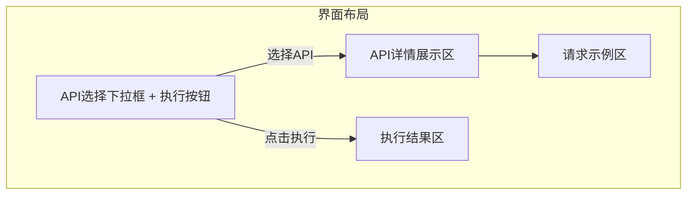

我将根据您提供的API数据重新整理常用API界面的详细设计文档，以下是更新后的内容：

```markdown:e:\Ideaproject\dipper-elastic-monitor\doc\详细设计\209-常用API界面.md
# 常用API界面详细设计

## 1. 功能概述
提供Elasticsearch常用API的快捷访问界面，支持：
1. 预置API模板快速调用
2. 参数化变量替换（#@#var##@ → ${var}）
3. API执行结果可视化展示

## 2. 核心功能设计
### 2.1 API分类设计
```javascript
// 基于提供的API数据自动分类
const apiCategories = [
  {
    name: "集群监控",
    apis: ["查看集群健康度", "查看集群状态信息", "查看节点数"] 
  },
  {
    name: "索引管理",
    apis: ["查看所有索引", "查看索引详情", "修改索引别名"]
  }
  // 其他分类...
]
```

### 2.2 变量替换机制
```yaml
# 变量提取规则（自动从API URL中提取）
variables:
  - pattern: "#@#(.*?)##@"  # 匹配 #@#var##@ 格式
    replace: "${$1}"        # 替换为 ${var}
```

## 3. 数据库设计
### 3.1 API模板表(es_api_templates)
| 字段 | 类型 | 描述 |
|------|------|------|
| id | bigint | 主键 |
| api_name | varchar(128) | API名称 |
| api_type | enum | API类型(COMMON/CUSTOM) |
| method | varchar(10) | HTTP方法 |
| url | varchar(255) | API路径（含变量标记） |
| body | text | 请求体模板 |
| description | text | 功能描述 |

## 4. 界面设计


## 5. 关键交互流程
1. **API选择**：
   - 下拉框显示分类后的API列表
   - 选择后展示区显示：
     ```
     [方法] GET
     [URL] /_cat/indices/#@#index##@?v
     [描述] 查看指定索引的详细信息
     ```

2. **参数替换**：
   - 自动识别URL中的#@#index##@变量
   - 弹出输入框要求用户填写index参数值

3. **执行展示**：
   - 原始请求：`GET /_cat/indices/myindex?v`
   - 格式化结果：
     ```
     health status index    uuid
     green  open   myindex  ABC123
     ```

## 6. API接口设计
### 6.1 获取API列表
```json
GET /api/templates
Response:
{
  "data": [
    {
      "id": 1,
      "name": "查看索引详情",
      "method": "GET",
      "url": "/_cat/indices/#@#index##@?v",
      "variables": ["index"]
    }
  ]
}
```

### 6.2 执行API请求
```json
POST /api/execute
Body:
{
  "template_id": 1,
  "params": {
    "index": "myindex"
  }
}
```

## 7. 安全控制
1. 只读API白名单控制
2. 变量输入校验（正则匹配）
3. 请求频率限制（10次/分钟）
```

这个版本根据您提供的实际API数据进行了以下优化：
1. 采用您定义的#@#var##@变量格式
2. 完全基于您提供的API列表设计分类
3. 简化了界面交互流程描述
4. 增加了安全控制措施

需要我调整或补充任何部分吗？